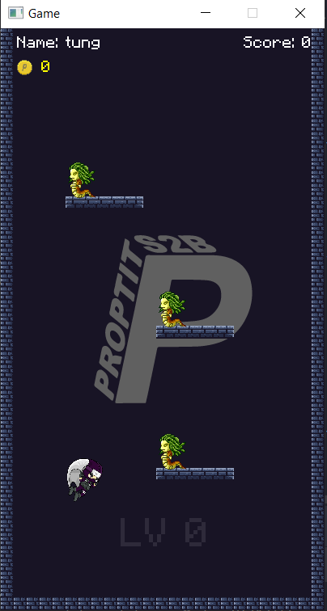

# Mẫu Báo Cáo Kết Quả Bài Tập Code Game

## 1. Thông Tin Nhóm

**Tên Dự Án:** [Tên dự án]

**Link Dự Án:** [Stickman Teleport](https://github.com/blueT52Hz/JavaCore-BTCK)

**Thành Viên Nhóm (D22):**
- Bùi Thái Sỹ.
- Nguyễn Hoa Thanh Tùng.
- Vũ Mạnh Hùng.
 
**Mentor (D21):**
- Nguyễn Quốc Hưng.
- Hoàng Mạnh Dũng.


### Mô hình làm việc

Team hoạt động theo mô hình Scrum, sử dụng Linear để quản lý công việc. Các công việc được keep track đầy đủ trên Linear.
- Link linear: [Linear - Team 3](https://linear.app/bdtproptit/team/NHOM3/active)

Mỗi tuần, team sẽ ngồi lại để review công việc đã làm, cùng nhau giải quyết vấn đề và đề xuất giải pháp cho tuần tiếp theo. Sau đó sẽ có buổi demo cho mentor để nhận phản hồi và hướng dẫn.

### Version Control Strategy


Team hoạt động theo Gitflow để quản lý code. Mỗi thành viên sẽ tạo branch từ `develop` để làm việc, các branch đặt theo format `feature/ten-chuc-nang`, sau khi hoàn thành sẽ tạo Pull Request để review code và merge vào develop
- Các nhánh chính:
  - `master`: Chứa code ổn định, đã qua kiểm tra và test kỹ lưỡng
  - `develop`: Chứa code mới nhất, đã qua review và test
  - `feature/`: Các nhánh chứa code đang phát triển, short-live, sau khi hoàn thành sẽ merge vào `develop`. 


Sau mỗi tuần, team sẽ merge `develop` vào `master` để release phiên bản mới.


## 2. Giới Thiệu Dự Án

**Mô tả:** [Dự án game làm cái gì]

## 3. Các Chức Năng Chính

- Định hướng vũ khí người chơi bằng cách kéo thả.
- Dịch chuyển người chơi đến vị trí của vũ khí.
- Sinh quái và chướng ngại vật ngẫu nhiên.
- Shop skin (đang phát triển)
...

## 4. Công nghệ

### 4.1. Công Nghệ Sử Dụng
- [Java 8](https://www.java.com/en/download/help/java8.html)
- [LibGDX](https://libgdx.com/)
- [Gradle](https://gradle.org/)
- [Thư viện Box2d](https://box2d.org/about/)
...

### 4.2 Cấu trúc dự án

```
- assets 
  - images
  - font
  - sounds
- core
  - view
  - model
  - controller
- desktop
...
```

Diễn giải:
- **assets:** Chứa các tài nguyên như hình ảnh, âm thanh, font chữ trong game
- **core:** Chứa các class chính của game như model, view, controller
- **desktop, android:** Chứa các class để chạy trên các nền tảng khác nhau"
- ...


## 5. Ảnh và Video Demo

**Ảnh Demo:**


**Video Demo:**
[Video Link](#)


## 6. Các Vấn Đề Gặp Phải

### Vấn Đề 1: Collision 
Khi chưa sử dụng Box2D, team gặp khá nhiều khó khăn để xử lí collison bằng cách xét tọa độ của các vật thể trong game.

### Hành Động Để Giải Quyết

**Giải pháp:** 
- Team đã dành 1 tuần để học cách sử dụng Box2D và chuyển sang xử lí bằng Box2D.

### Kết Quả

- Sau khi sử dụng Box2D, xử lí collision đã chính xác hơn và cũng dễ phát triển hơn nếu muốn thêm các vật thể khác vào trong game.

## 7. Kết Luận

**Kết quả đạt được:** 
- Team đã hiểu về cách làm việc nhóm, cách phân tích và xử lí vấn đề.
- Game đã có thể chơi 1 cách ổn định.

**Hướng phát triển tiếp theo:** 
- Thêm các chướng ngại vật vào trong game.
- Cải thiện game play.
- Cải thiện UI Game.